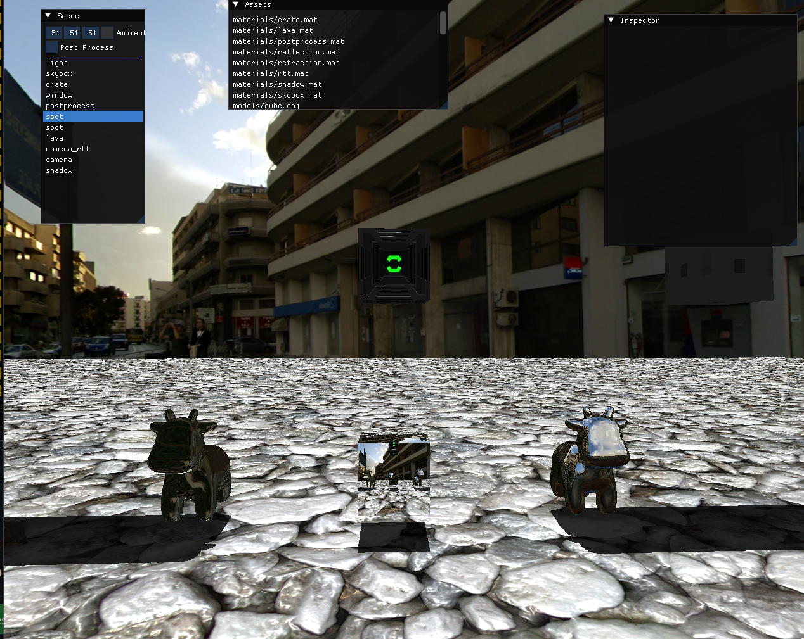

# **GAT350 OGL Project**

## **Introduction**

This project is a modern C++ software renderer built on top of **OpenGL**, featuring a programmable rendering pipeline with support for **custom vertex and fragment shaders**, **Gouraud and Phong lighting**, and a flexible **post-processing framework**.
It is designed as an educational, modular, and extensible renderer implementation, leveraging **SDL3** for window and input management and **glm** for mathematics.

The goal of the project is to provide a clear reference implementation of a lightweight rendering engine capable of demonstrating classic and modern shading techniques without relying on a heavyweight game engine for the purposes of learning computer graphics.

---

## **Features**

* **Programmable Shading Pipeline**

  * Custom **vertex shaders**
  * Custom **fragment shaders**
* **Lighting Models**

  * **Gouraud shading** (per-vertex)
  * **Phong shading** (per-pixel)
* **Post-Processing Effects**

  * Configurable post-processing stage with pluggable filters
* **Transform & Projection Utilities**

  * glm-powered matrices (model, view, projection)
* **OpenGL Rendering Backend**

  * Efficient buffer management
  * Shader loading/compilation utilities
* **SDL3 Integration**

  * Window and context creation
  * Input handling
  * Main application loop
* **Clean C++ Codebase**

  * C++20
  * Modular architecture (renderer, shaders, scene, utilities)

---

## **Installation**

### **Prerequisites**

Ensure the following dependencies are installed on your system:

* **CMake** (3.10+)
* **C++20-compatible compiler**
* **OpenGL** (3.3+ recommended)
* **SDL3**
* **glm**

### **Build Instructions**

```bash
git clone https://github.com/charl-neu/GAT350-OpenGL
cd GAT350-OpenGL
mkdir build && cd build
cmake ..
make
```


---

## **Usage**

### **Basic Execution**

Simply run the executable to launch the demo scene:

```bash
./Build/
  application.exe
```

### **Modifying Shaders**

Vertex and fragment shaders can be found under:

```
/Build/Assets/Shaders
```

To integrate your own shader:

1. Create a new shader file in the corresponding directory.
2. Make a corresponding .prog file which integrates the .vert and .frag files in the same directory
3. in /Build/Assets/Materials/ make a material utilizing the .prog file
4. in /Build/Assets/Scenes/ Either make a new scene or edit another one (by default scene 2 is used) and make an object use the corresponding material
5. Rebuild and run the project.

### **Adding New Scenes or Models**

* Place assets such as textures/materials/etc in the relevant `/Build/Assets/` directory.
* If you used a Scene but Scene2.json, change line 27 in main to the relevant scene.

---

## **Technical Details**

### **Renderer Architecture**

* **Software Rendering Layer:**
  Emulates a programmable pipeline with transform, lighting, rasterization, and fragment shading.
* **OpenGL Backend:**
  Handles buffer uploads, textured quads, and final presentation.
* **Math Layer (glm):**
  Used for vectors, matrices, quaternions, and common transformations.

### **Lighting Model**

* **Gouraud:**
  Lighting computed per vertex → interpolated across fragments.
* **Phong:**
  Normal interpolation + per-pixel lighting.

### **Post-Processing Pipeline**

The renderer outputs to an off-screen framebuffer, which is then passed through a chain of post-processing passes (e.g., grayscale, blur, custom effects).

---

## **Visual Showcase**

### **Real-Time Rendering Example**

**Example Scene**


---

## **Attribution**

This project uses the following open-source libraries:

* **SDL3** – Simple DirectMedia Layer
* **glm** – OpenGL Mathematics Library
* **ImGui** - Simple GUI layout
* **RapidJSON** - JSON control
* **FMod** - Audio (unused I think?)
* **assimp** - Model importing
* **Glad** - OGL function loading

---
This C++ renderer was made for my GAT350 class.
---

